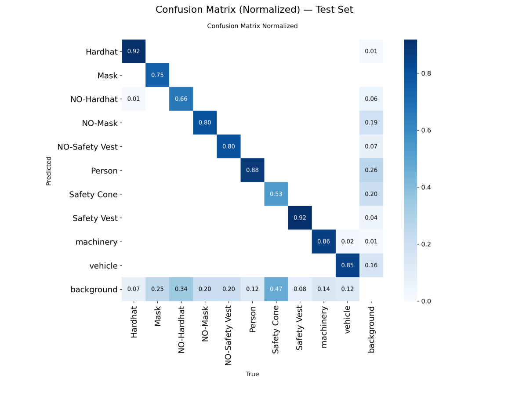
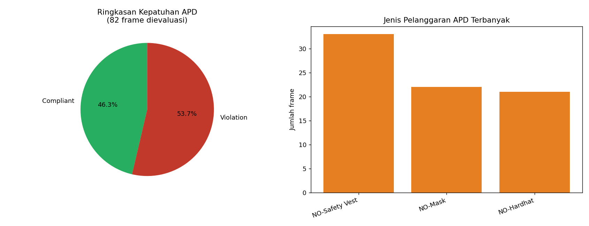

# PPE-Detection-OilGas-Safety
# AI/ML PPE Compliance Detection for Oil & Gas Rig Safety (i-CCTV)

## 📌 Business Context & Pain Point
Penerapan *Computer Vision* berbasis **YOLOv8 Object Detection** untuk mendeteksi kepatuhan Alat Pelindung Diri (APD/PPE) secara otomatis pada operasi Rig Drilling & Completion. 

* **Problem:** Pengawasan CCTV manual rentan *fatigue* dan tidak *scalable* seiring lonjakan jumlah rig aktif.
* **Solution:** Pipeline AI berbasis YOLOv8 + *Business Rule Layer* untuk mengklasifikasikan status pekerja secara real-time (**COMPLIANT** vs **VIOLATION**).

## 🛠️ Project Structure
* `data/` — Konfigurasi dataset & sampel evaluasi.
* `figures/` — Dashboard kepatuhan, confusion matrix, & hasil inferensi.
* `model/` — Bobot model terbaik (`ppe_yolov8_best.pt`).
* `PPE_Detection_OilGas_CaseStudy.ipynb` — Notebook lengkap pipeline pelatihan & inferensi.

## 📊 Results & Visualization

